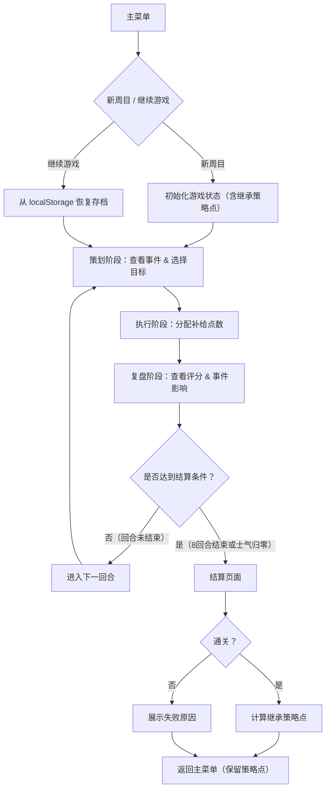

## 1. 产品概述

办公楼应急演练回合制资源分配游戏——玩家扮演策划者、执行者和复盘者三种角色，在模拟的办公楼应急场景中为通信、餐饮、医疗和维修四个小组分配有限补给点数，应对电力不足、人员疲劳、路线受阻和紧急需求等随机事件，通过多周目继承策略点逐步提升通关表现。

- 目标用户：喜欢单机策略/模拟类游戏的休闲玩家
- 核心价值：考验资源分配决策能力，多周目成长带来持续挑战动力

## 2. 核心功能

### 2.1 用户角色

| 角色 | 触发时机 | 核心职责 |
|------|----------|----------|
| 策划者 | 每回合开始 | 选择本回合目标优先级，查看当前局势 |
| 执行者 | 策划完成后 | 向四个小组分配补给点数（受总量限制） |
| 复盘者 | 分配结算后 | 查看任务完成率、士气、风险评分及事件影响 |

### 2.2 功能模块

1. **主菜单页面**：开始新周目、继续游戏、查看历史战绩、多周目继承策略点
2. **游戏主页面**：包含策划阶段、执行阶段、复盘阶段三个子视图，构成完整回合
3. **结算页面**：单局通关/失败结算，展示最终评分和继承策略点

### 2.3 页面详情

| 页面名称 | 模块名称 | 功能描述 |
|----------|----------|----------|
| 主菜单 | 新游戏入口 | 开始新周目，可选择是否使用继承策略点 |
| 主菜单 | 继续游戏 | 从 localStorage 读取存档，恢复上次进度 |
| 主菜单 | 历史战绩 | 展示过往周目的通关评分和关键数据 |
| 游戏主页-策划阶段 | 目标选择 | 展示当前回合随机事件，选择本回合目标优先级（通信/餐饮/医疗/维修） |
| 游戏主页-策划阶段 | 局势面板 | 显示各小组当前状态、士气值、风险等级 |
| 游戏主页-执行阶段 | 资源分配 | 滑块/输入框分配补给点数给四个小组，总量受限 |
| 游戏主页-执行阶段 | 分配预览 | 实时预览分配效果（预计完成率、士气变化） |
| 游戏主页-复盘阶段 | 评分面板 | 展示本回合任务完成率、士气变化、风险变化 |
| 游戏主页-复盘阶段 | 事件回顾 | 展示本回合事件影响详情 |
| 游戏主页-复盘阶段 | 下一回合 | 确认后进入下一回合 |
| 结算页面 | 通关/失败结果 | 展示最终综合评分（任务完成率+士气+风险） |
| 结算页面 | 策略点继承 | 通关后保留少量策略点，用于下次周目增益 |

## 3. 核心流程

玩家进入主菜单 → 选择新周目/继续游戏 → 进入回合循环：策划阶段（查看事件+选目标）→ 执行阶段（分配补给点数）→ 复盘阶段（查看评分）→ 判断是否通关/失败 → 若通关则结算并继承策略点 → 可选择再开新周目

## 4. 用户界面设计

### 4.1 设计风格

- **主色调**：深灰蓝（#1a2332）为底色，搭配琥珀色（#f59e0b）作为强调色，传达"应急指挥中心"氛围
- **辅助色**：低饱和度红（#ef4444）表示风险/危险，绿色（#22c55e）表示士气/完成
- **按钮风格**：圆角矩形，带微光边框效果，hover 时发光
- **字体**：使用 Rajdhani（display）+ Noto Sans SC（正文），军事/工业仪表风格
- **布局风格**：仪表盘式卡片布局，顶栏显示回合信息和全局资源
- **图标风格**：Lucide 线性图标

### 4.2 页面设计概览

| 页面名称 | 模块名称 | UI 元素 |
|----------|----------|---------|
| 主菜单 | 标题区 | 大号 Rajdhani 字体标题，琥珀色发光效果 |
| 主菜单 | 按钮区 | 3D 感圆角按钮，hover 发光动画 |
| 游戏主页 | 顶部状态栏 | 回合数、总补给点、士气条、风险等级指示灯 |
| 策划阶段 | 事件卡片区 | 卡片展示随机事件，带脉冲动画 |
| 策划阶段 | 目标选择区 | 四个可点击小组卡片，选中高亮 |
| 执行阶段 | 分配滑块区 | 四组滑块+数值，实时显示剩余点数 |
| 执行阶段 | 预览面板 | 仪表盘风格预测数据 |
| 复盘阶段 | 评分卡片区 | 圆形进度条显示完成率，箭头指示士气/风险变化 |
| 复盘阶段 | 事件影响列表 | 带图标的影响条目 |
| 结算页面 | 综合评分 | 大号数字 + 评级（S/A/B/C/D） |
| 结算页面 | 策略点展示 | 琥珀色发光数字，继承提示 |

### 4.3 响应式设计

- 桌面优先设计，最小宽度 1024px
- 平板适配：卡片从横排变竖排
- 移动端：简化动画，使用折叠面板

### 4.4 游戏规则详细设计

**回合流程**（共 8 回合）：
1. 策划阶段：系统随机生成 1-2 个事件（电力不足/人员疲劳/路线受阻/紧急需求），玩家选择一个小组作为本回合重点目标（该小组效率+20%）
2. 执行阶段：玩家将总补给点数（每回合基础10点 + 继承策略点加成）分配给四个小组
3. 复盘阶段：结算各小组表现，计算任务完成率、士气和风险变化

**评分规则**：
- 任务完成率：重点目标小组分配≥3点则完成，其他小组分配≥2点则完成
- 士气：完成目标的小组士气+10，未完成-15；被选为重点的小组额外+5
- 风险：每回合基础风险+5，事件增加额外风险，分配不足的小组风险+10
- 士气归零或8回合后综合评分

**多周目继承**：
- 通关后根据评分获得策略点（S级=5点，A级=4点，B级=3点，C级=2点，D级=1点）
- 策略点可在新周目中使用，每点增加1点补给/回合
- 策略点存储在 localStorage
