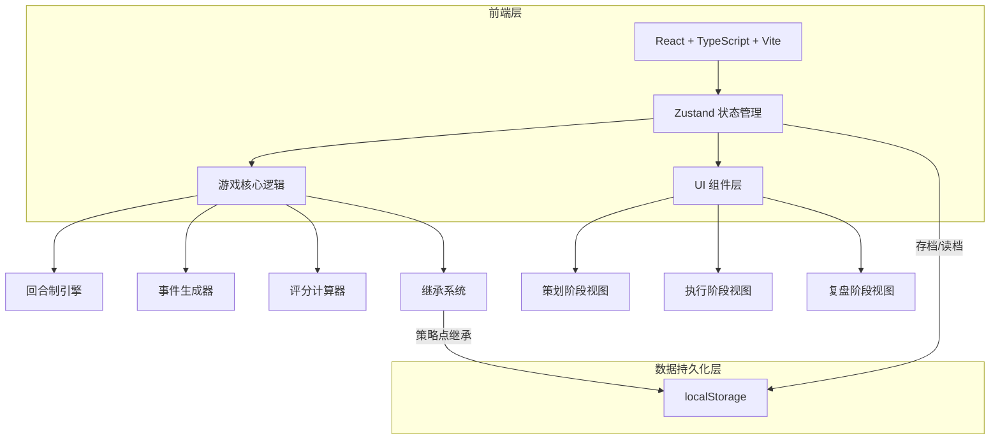
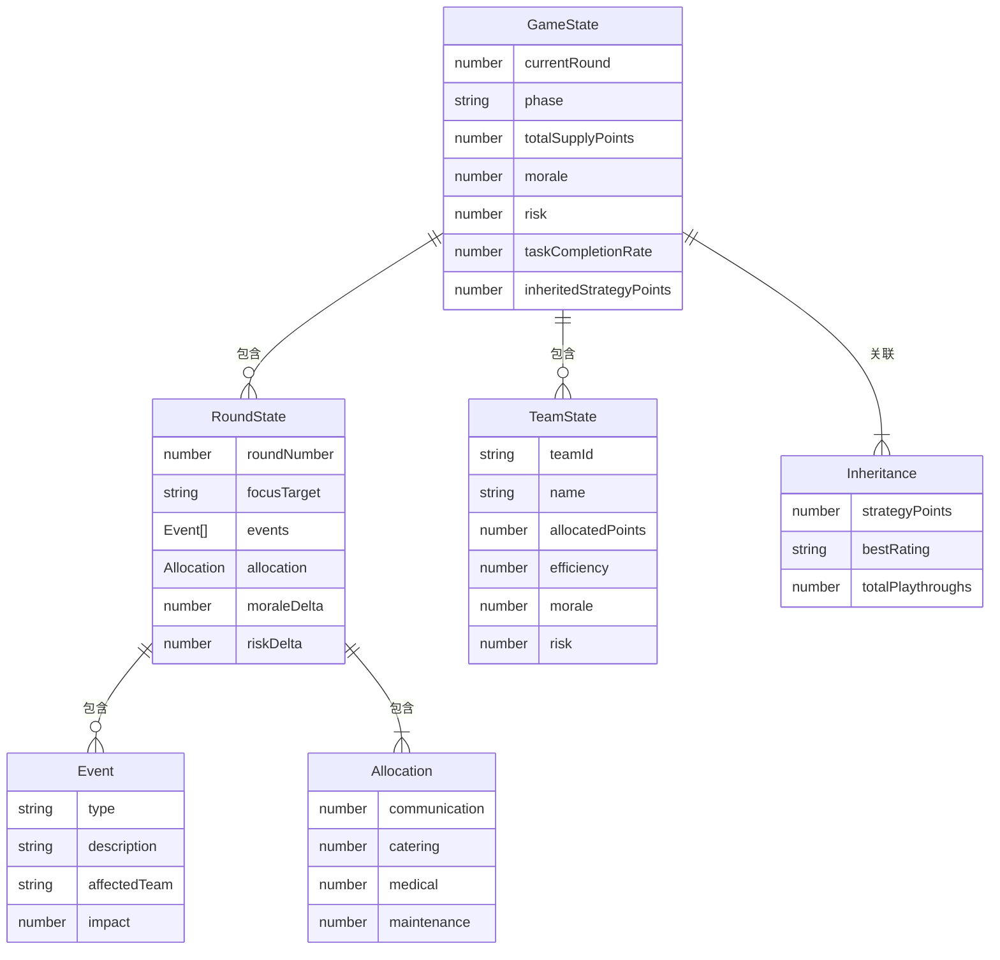

## 1. 架构设计



## 2. 技术说明

- **前端框架**：React@18 + TypeScript + Vite
- **状态管理**：Zustand（游戏全局状态、回合状态、存档状态）
- **样式方案**：Tailwind CSS 3
- **路由**：react-router-dom v6
- **图标库**：lucide-react
- **动画**：CSS transitions + keyframes
- **初始化工具**：vite-init（react-ts 模板）
- **后端**：无（纯前端，localStorage 持久化）
- **数据库**：无（localStorage 代替）

## 3. 路由定义

| 路由 | 用途 |
|------|------|
| `/` | 主菜单页面 |
| `/game` | 游戏主页面（含策划/执行/复盘三阶段） |
| `/result` | 结算页面（通关/失败） |

## 4. 数据模型

### 4.1 游戏状态模型



### 4.2 localStorage 数据结构

```typescript
interface SaveData {
  gameState: GameState;
  roundHistory: RoundState[];
  inheritance: Inheritance;
  timestamp: number;
}

interface Inheritance {
  strategyPoints: number;
  bestRating: string;
  totalPlaythroughs: number;
}
```

## 5. 核心模块设计

### 5.1 游戏引擎（gameEngine.ts）

- `startNewGame(inheritedPoints: number)`: 初始化新周目
- `startRound()`: 生成事件，进入策划阶段
- `setFocusTarget(teamId: TeamId)`: 设置重点目标
- `allocateResources(allocation: Allocation)`: 分配补给点数
- `resolveRound()`: 结算本回合，计算评分
- `checkGameEnd()`: 判断游戏是否结束
- `calculateFinalScore()`: 计算最终评分和继承策略点

### 5.2 事件生成器（eventGenerator.ts）

- 事件类型：`power_shortage`（电力不足）、`fatigue`（人员疲劳）、`route_blocked`（路线受阻）、`emergency`（紧急需求）
- 每回合随机生成 1-2 个事件
- 每个事件影响特定小组的效率或士气

### 5.3 评分计算器（scoreCalculator.ts）

- 任务完成率：基于分配点数和重点目标
- 士气变化：基于任务完成情况和事件影响
- 风险变化：基于事件和分配不足
- 最终评级：综合三项指标得出 S/A/B/C/D

### 5.4 存档管理（saveManager.ts）

- `saveGame(state: GameState)`: 保存到 localStorage
- `loadGame(): SaveData | null`: 从 localStorage 读取
- `saveInheritance(data: Inheritance)`: 保存继承数据
- `loadInheritance(): Inheritance | null`: 读取继承数据
- `clearSave()`: 清除存档

## 6. 组件结构

```
src/
├── components/
│   ├── layout/
│   │   └── GameHeader.tsx          # 顶部状态栏
│   ├── planning/
│   │   ├── EventCards.tsx          # 事件卡片
│   │   └── TargetSelector.tsx      # 目标选择
│   ├── execution/
│   │   ├── ResourceSlider.tsx      # 资源分配滑块
│   │   └── AllocationPreview.tsx   # 分配预览
│   ├── review/
│   │   ├── ScorePanel.tsx          # 评分面板
│   │   └── EventReview.tsx         # 事件回顾
│   └── common/
│       ├── CircularProgress.tsx    # 圆形进度条
│       └── StatusIndicator.tsx     # 状态指示灯
├── pages/
│   ├── MainMenu.tsx                # 主菜单
│   ├── GamePage.tsx                # 游戏主页面
│   └── ResultPage.tsx              # 结算页面
├── store/
│   └── gameStore.ts                # Zustand 游戏状态
├── engine/
│   ├── gameEngine.ts               # 游戏引擎
│   ├── eventGenerator.ts           # 事件生成器
│   └── scoreCalculator.ts          # 评分计算器
├── utils/
│   └── saveManager.ts              # 存档管理
└── types/
    └── game.ts                     # 类型定义
```
